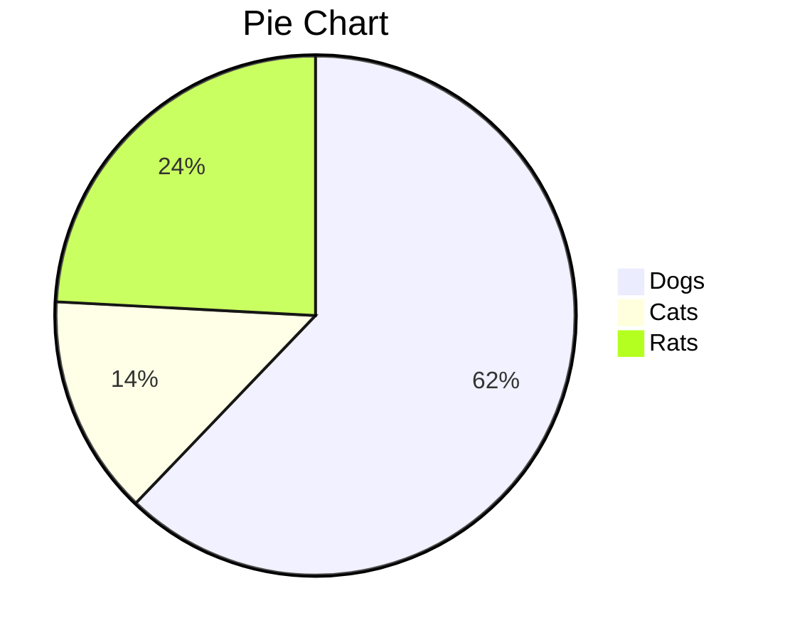

# OneLight

[TOC]

## 二级标题

### 三级标题

#### 四级标题

##### 五级标题

###### 六级标题


行内公式：$\lim\limits_{x \to \infty} \exp(-x)=0$，行间公式：
$$
E_0 = mc^2 \\
\quad\text{—— Albert Einstein}
$$

可以直接用尖括号包裹URL链接或邮箱：<https://clb.pages.dev>

> 引用块
>

**github警告框**

> [!NOTE]
>
> 

> [!TIP]
>
> 

> [!IMPORTANT]
>
> 

> [!WARNING]
>
> 

> [!CAUTION]
>
> 


- 无序列表
  - 无序列表 
    - 无序列表

1. 有序列表
2. 2
3. 3

==文本高亮== __加粗__ *斜体* ==***斜体高亮加粗***== ~~删除线~~ <u>下划线</u> <span alt='highlight'>高亮</span>

**代码块**

```js
export default defineConfig({
    plugins: [
        vue(),
        AutoImport({
            resolvers: [ElementPlusResolver()],
        }),
        Components({
            resolvers: [ElementPlusResolver()],
        }),
    ],
    resolve: {
        alias: {
            '@': fileURLToPath(new URL('./src', import.meta.url))
        }
    },
    //http proxy
    server: {
        host: 'localhost',
        port: 5173,
        proxy: {
            '/api': {
                target: 'http://localhost:8080', //backend
                changeOrigin: true,
                rewrite: (path) => path.replace(/^\/api/, '')
            }
        }
    },
})
```

| 时间                | 人数 | 地点 |
| :------------------ | :--: | ---: |
| 2024-12-15 12:34:59 | 123  | 上海 |
| 2024-12-15 12:35:03 | 456  | 北京 |
| 2024-12-15 12:35:07 | 789  | 深圳 |
|                     |      |      |

**图片**


**音频**

<audio controls="controls">
  <source src="https://bin-music.netlify.app/songs/ラブソングが歌えない-結束バンド.mp3" type="audio/mp3" />
</audio>
**饼图**




任务列表：

- [ ] 未完成任务1
- [ ] 未完成任务2
- [x] 已完成任务1
- [x] 已完成任务2

> 此文档参考自 [typora-dyzj-theme](https://github.com/muggledy/typora-dyzj-theme)，感谢作者muggledy
